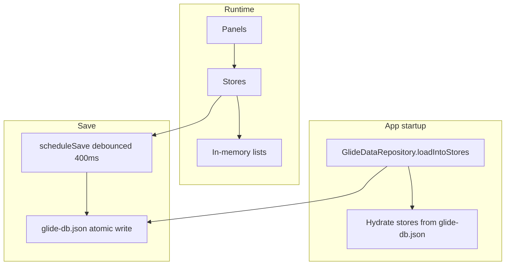

# JSON on-disk persistence

Business data is stored in memory in `*Store` singletons and persisted to JSON on macOS desktop.

---

## Terminology (UI ↔ JSON ↔ code)

| UI panel / label | JSON field | Kotlin type | Store |
|------------------|------------|---------------|--------|
| **Leads** | `leads` | `Lead` | `LeadStore` |
| **Sold Plans** | `soldPlans` | `SoldPlan` | `SoldPlanStore` |
| **Plans** | `plans` | `Plan` | `PlanStore` |
| **Clients** | `clients` | `Client` | `ClientStore` |
| **Students** | `students` | `Student` | `StudentStore` |
| **Billing** → bills | `bills` | `Bill` | `BillStore` |
| **Billing** → payments | `payments` | `Payment` | `PaymentStore` |
| **Billing** → attendance credits | `attendanceCredits` | `AttendanceCredit` | `AttendanceCreditStore` |
| **Billing** → plan enrollment | `soldPlanEnrollments` | `SoldPlanEnrollment` | `SoldPlanEnrollmentStore` |
| **Classes** | `classes` | `Class` | `ClassStore` |
| **Terms** | `terms` | `Term` | `TermStore` |
| **Locations** | `locations` | `Location` | `LocationStore` |
| *(sold plan on class)* | `soldPlanClassSchedules` | `SoldPlanClassSchedule` | `SoldPlanClassScheduleStore` |
| **Attendance** | `attendanceRecords` | `AttendanceRecord` | `AttendanceStore` |
| **Attendance** (submitted) | `submittedAttendanceSessions` | `AttendanceSessionKey` | `AttendanceStore` |

**Term calendar** is a view over `classes`, `terms`, and attendance — not its own collection.

---

## Directory layout

**Application Support** (database + settings):

```
~/Library/Application Support/Glide/
  settings.properties
  data/
    glide-db.json
    glide-db.json.bak
    .glide-db.json.tmp
```

On first launch, `settings.properties` is migrated from the legacy path  
`~/Documents/Glide/settings.properties` if it exists there.

**Documents** (user-visible exports only):

```
~/Documents/Glide/
  invoices/
  receipts/
```

---

## Snapshot shape

```json
{
  "schemaVersion": 1,
  "savedAtMillis": 1716547200000,
  "plans": [],
  "clients": [],
  "students": [],
  "leads": [],
  "soldPlans": [],
  "soldPlanEnrollments": [],
  "bills": [],
  "payments": [],
  "attendanceCredits": [],
  "terms": [],
  "locations": [],
  "classes": [],
  "soldPlanClassSchedules": [],
  "attendanceRecords": [],
  "submittedAttendanceSessions": []
}
```

`leads` and `soldPlans` are separate arrays (no shared `PeopleGroup` type in JSON).

### Example (abbreviated)

```json
{
  "schemaVersion": 1,
  "savedAtMillis": 1716547200000,
  "leads": [
    {
      "id": "lead-1",
      "mainClientId": null,
      "clientName": "Alex Smith",
      "studentIds": [],
      "planId": "plan-1",
      "planStartDate": "2026-09-01",
      "mainClientAttendsClass": true,
      "status": "New",
      "notes": "",
      "createdAtMillis": 1710000000000
    }
  ],
  "soldPlans": [
    {
      "id": "sold-1",
      "mainClientId": "client-1",
      "studentIds": ["student-1"],
      "planId": "plan-1",
      "planStartDate": "2026-09-01",
      "mainClientAttendsClass": true,
      "notes": "",
      "createdAtMillis": 1710100000000
    }
  ],
  "soldPlanEnrollments": [
    {
      "id": "enr-1",
      "soldPlanId": "sold-1",
      "planSnapshot": {
        "planId": "plan-1",
        "planName": "10 Week Pack",
        "kind": "MULTI_LESSON_PLAN",
        "lessonCount": 10,
        "rolling": false,
        "priceAmountMinor": 15000,
        "currencyCode": "HKD"
      },
      "status": "ACTIVE",
      "startedAtMillis": 1710100000000,
      "planPeriodStartedAtMillis": 1710100000000,
      "renewalStoppedAtMillis": null,
      "notes": ""
    }
  ],
  "classes": [
    {
      "id": "class-1",
      "name": "Tuesday Ballet",
      "soldPlanIds": ["sold-1"]
    }
  ],
  "submittedAttendanceSessions": [
    { "classId": "class-1", "sessionDate": "2026-05-20" }
  ]
}
```

---

## Code architecture



Key types: `GlideDataSnapshot`, `GlideDataRepository`, `persistAppData()` (called from store mutators).

### Load / save

- **Load:** `GlideDataRepository.loadIntoStores()` in `Glide.kt` before the window opens.
- **Save:** debounced after mutations via `persistAppData()` → `GlideDataRepository.scheduleSave()`.
- **Flush:** `flushPendingSave()` then `saveNow()` on window close.

Panel layout, selection, and `AppViewState` are **not** persisted.

---

## Serialization

- `kotlinx-serialization-json` with `prettyPrint = true`, `ignoreUnknownKeys = true`
- Model types in `glide.model` use `@Serializable`
- Enums serialize as strings (`ACTIVE`, `PRESENT`, …)

---

## Safe writes

Write `.tmp` → copy previous file to `.bak` → rename to `glide-db.json`. On load failure, try `.bak`; otherwise start with empty stores.

---

## Schema migrations

| Version | Change |
|---------|--------|
| 1 | Initial UI-aligned snapshot |

Future versions can use `schemaVersion` and migration logic in `readDataSnapshot()`.

---

## Startup sequence

```
AppSettingsStore.load()
GlideDataRepository.loadIntoStores()
application { App() }
```

On quit: flush debounced save, then `saveNow()`.
